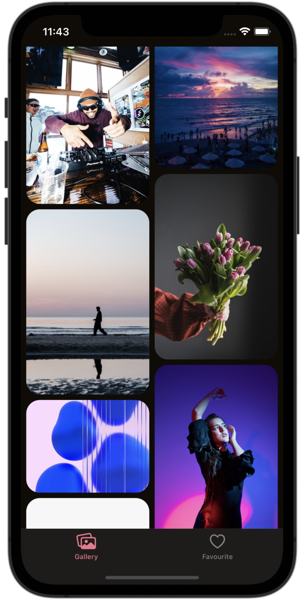
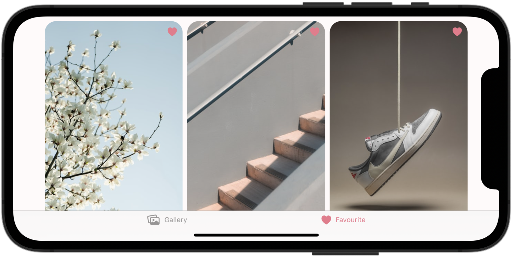
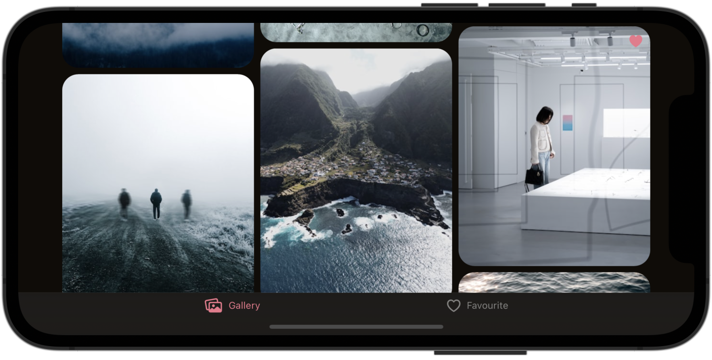
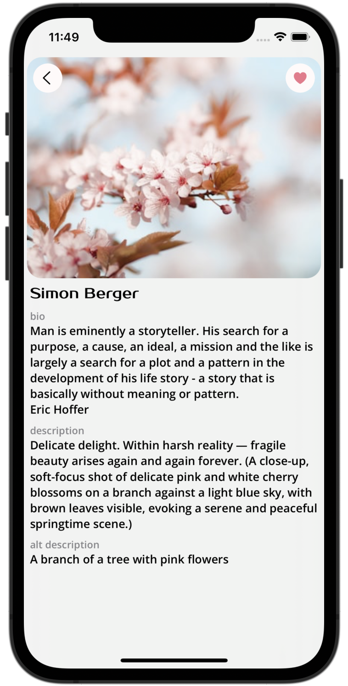
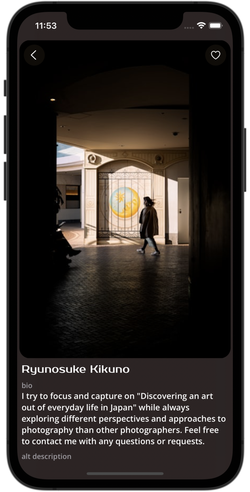

# Gallery App 🖼

## Contact Information 📱
- **Telegram**: https://t.me/soldansd
- **LinkedIn**: www.linkedin.com/in/daniil-solovyev
- **Email**: danielsolovyev@gmail.com

## Overview 📝

**Image Gallery App** – an iOS application that allows users to explore, view, and like their favorite images fetched from the [Unsplash API](https://unsplash.com/developers). The app showcases key iOS development skills, including designing user interfaces, handling data retrieval, and ensuring smooth data storage.

This project was developed as a demonstration of iOS development abilities. The app offers a user-friendly and visually appealing interface, making it easy to browse through a collection of curated images, view detailed information about each image, and mark favorites. It also features image pagination and caching to deliver a fast and seamless user experience."

## **Image API Warning ⚠️**
**Warning**: The Unsplash API can provide the **same images multiple times** across different pages. For example, an image that appears as the **last** on page 1 could appear as the **third** on page 2. This behavior is due to the nature of the API’s pagination system.

**Be mindful of potential duplicate images when using the app.**

## Key Functionalities 🎯
#### **Image Gallery Screen** 📷
- Displays a grid of thumbnail images fetched from the Unsplash API.
- Each thumbnail is tappable, leading to the **Image Detail Screen**.
- **Pagination** loads more images as the user scrolls down.
- **Favorite images** are visually indicated on the thumbnails ❤️.
- The grid is created using a **custom WaterfallLayout**, where each cell has a constant width based on the screen width (from 2 to 4 columns), and the cell height is adjusted to preserve the original image's aspect ratio.

#### **Image Detail Screen** 🌅
- Displays the selected image in a larger view, along with **additional details** such as the name of the photographer, the photographer's bio, and a description of the image.
- Users can **mark an image as a favorite** by tapping a heart-shaped button.
- **Swipe gestures** allow users to navigate between images ↔️.
- **Adaptive background color**, each screen adapts to the **primary color** of the displayed image 🎨.

#### **Device Orientation Support** 🔄
- The app supports both **portrait and landscape orientations**, ensuring a seamless experience on all iOS devices.

#### **Theme Support** 🌗
- The app supports both **light and dark themes**.
- The **app’s icon** dynamically changes to match the selected theme.

#### **Fonts** 📖 
- **Custom fonts** are used throughout the app to enhance the visual appeal and provide a unique, polished look.

---

## Technical Solutions 💡
### **Architecture** 🏗️:
The app follows the **MVP (Model-View-Presenter) + Router** architecture, ensuring a clean separation of concerns for modularity, scalability, and testability.

- **Model** handles the data of business objects.
- **View** is responsible for presenting the UI to the user.
- **Presenter** acts as the intermediary between the View and Model, handling the business logic to update the UI.
- **Router** is responsible for navigation between screens, providing a modular approach to routing.
- **Builder** is used to create and configure MVP+R modules in the app. This allows easy construction of the app's screen modules with proper dependencies injected, promoting better separation of concerns and flexibility when adding new features.


Presenters in the app use **PhotoPaginationManager** as a **dependency injection**. This ensures that all components of the app work with the same array of images, promoting consistency and preventing data duplication. 

Additionally, **NotificationCenter** is used to notify presenters (observers) when the **array of photos in PhotoPaginationManager** (observable) has been updated 🔔. This allows presenters to react immediately when new images are loaded, ensuring seamless UI updates.

### **Managers** 🛠️:
The app uses several **managers** to handle different responsibilities, ensuring modularity and separation of concerns:
- **NetworkManager**: Handles all the network-related tasks, including making API requests to the Unsplash API to fetch images. The **NetworkManager** works with **data transfer objects (DTO)** and returns these DTOs, rather than returning the app's business models directly. This approach ensures that the data layer and business logic are decoupled.
- **CacheManager**: Manages image caching using **NSCache**, improving performance by storing images in memory, reducing the need to reload previously displayed images.
- **StorageManager**: Responsible for storing and retrieving data locally for the user's favorite images. It uses **FileManager** to save the images to the device's file system.
- **PhotoProvider**: The PhotoProvider follows the **Repository pattern** by centralizing data access and interacting with multiple data sources, such as NetworkManager, CacheManager, and StorageManager. It manages the retrieval and caching of images, ensuring that liked images are stored locally on the device, newly fetched images are cached appropriately, and network requests are made for new images. Additionally, PhotoProvider adheres to the **Facade pattern**, offering a unified interface for handling multiple subsystems. The PhotoProvider class relies on dependency injection for NetworkManager, CacheManager, and StorageManager to provide its functionality.

- **PhotoPaginationManager**: Manages the pagination of photos, ensuring that images are loaded progressively as the user scrolls through the gallery. It also has **PhotoProvider** as a dependency injection.

All managers in the app follow the **Singleton** pattern, ensuring that only one instance of each manager is used throughout the app.

Additionally, both **PhotoProvider** and **PhotoPaginationManager** provide the opportunity to create **custom objects** with provided dependencies.

### **Frameworks and Libraries** 🛠️:
- **UIKit** for building the user interface.
- **URLSession** for network requests to fetch images from the Unsplash API.
- **Grand Central Dispatch (GCD)** for managing asynchronous tasks, ensuring smooth performance by executing network requests, image caching, and storing images locally in the background without blocking the main thread.
- **NSCache** for caching images to enhance performance.
- **FileManager** for saving and retrieving images stored locally in the file system.
- **NotificationCenter** for notifying Presenters (observers) that the array of photos in PhotoPaginationManager (observable) has changed. This allows the UI to stay in sync with the latest data updates.
- **SwiftLintPlugins** for integrating **SwiftLint** into the project to enforce consistent code style and prevent potential issues️.

### **Unit Tests** 🧪
- **Unit tests** are implemented to ensure the correctness of core components, including:
  - **Gallery And Detail Screen Modules**: Tests for the **Presenter**, **Router**, and **Builder** of each module to ensure proper functionality of screens, including navigation, image loading, and the construction of the module components.
  - **CacheManager**: Verifying image caching behavior and ensuring that the images are cached and retrieved correctly.

## **Requirements** 📋

- iOS 15.0 or later
- App was created with Xcode 16.2

---

## Demo 📲

#### **Image Gallery Screen** 📷

<div align="center">
    
    
    
    
    
    
</div>

#### **Image Detail Screen** 🌅

<div align="center">
    
    
    
    
    
</div>

## **Installation & Configuration** ⚙️
1. Clone the repository:
   ```bash
   git clone <repository_url>
   ```
2. Open the project in Xcode.

3. You will need an **Unsplash API key** to run the app. Sign up at [Unsplash Developers](https://unsplash.com/developers) to get your key.
4. Create a **Config.xcconfig** file in your project and add the following line:
   ```bash
   API_KEY = <your_api_key>
   ```
5. Select the **top-level group** of the project.
6. Navigate to the **Info** tab.
7. In the **Configurations** section, choose either **Debug** or **Release** configuration.
8. Set **Config.xcconfig** as the value for the **Based on Configuration File** column.

---
